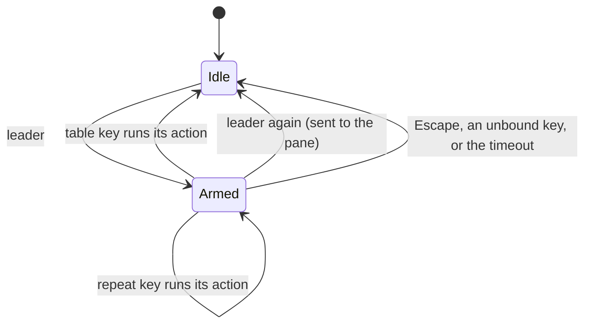

# Leader Key

One key that reaches every window, tab, pane, and par-mux session action, the same way in a local tab, an attached par-mux tab, and a tmux gateway tab.

## Table of Contents

- [Overview](#overview)
- [Using the Leader](#using-the-leader)
- [Key Table](#key-table)
- [Vim Keys](#vim-keys)
- [tmux Gateway Tabs](#tmux-gateway-tabs)
- [Configuration](#configuration)
- [Related Documentation](#related-documentation)

## Overview

Press the leader, then one key. The leader is `Cmd + B` on macOS and `Ctrl + Shift + B` on Linux and Windows. `Cmd` chords never reach the shell, and `B` echoes tmux's `C-b` prefix.

Every leader key runs a registry action, so `leader z` and the zoom chord (`Cmd + Shift + Enter`) run the same code. In an attached par-mux tab the action goes to the daemon, as the chord's does.

## Using the Leader

- **Which-key overlay.** If no key follows within `leader_overlay_delay_ms` (400 ms by default), an overlay at the bottom of the window lists every key the leader answers. Each row shows the key, the action, and the action's current chord. A rebind shows there at once, and an unbound action shows no chord.
- **Sending the leader to the shell.** Press the leader twice. The second press goes to the focused pane as the bytes the chord sends with the leader off: `Ctrl + Shift + B` sends `^B`. `Cmd + B` has no terminal encoding, so on macOS the second press only cancels.
- **Repeat keys.** Keys marked *repeat* keep the leader armed, so `leader → → →` moves focus three panes. The leader stays armed until a non-repeat key, `Escape`, or `leader_timeout_ms` (2 s by default) since the last key.
- **Cancelling.** `Escape` cancels. So does the timeout, and so does a key the table does not bind, which shows a short message.
- **Precedence.** The leader is checked before your keybindings, so a binding on the leader chord never runs. While armed, the leader takes every key. A dialog or picker that is open takes keys before the leader does.

## Key Table

Keys follow tmux wherever tmux has a convention.

| Key | Action | Notes |
|---|---|---|
| `c` | New tab | par-mux: a new daemon window |
| `n` / `p` | Next / previous tab | |
| `l` | Last-used tab | `Tab` with vim keys |
| `1`–`9` | Go to tab N | |
| `,` | Rename tab | |
| `&` | Close tab | par-mux: asks first on the session's last tab |
| `w` | Tree picker: windows, tabs, and panes | |
| `s` | Session picker (par-mux and tmux) | |
| `d` | Detach from the par-mux session | |
| `%` or `\|` | Split right | |
| `"` or `-` | Split down | |
| Arrows | Focus pane in that direction | *repeat* |
| `Shift` + Arrows | Swap with the pane in that direction | *repeat* |
| `o` | Next pane | *repeat* |
| `;` | Last-focused pane | |
| `q` | Show pane letters | |
| `z` | Toggle pane zoom | |
| `E` | Equalize panes | |
| `Space` | Cycle layout presets | |
| `r` | Resize mode | |
| `x` | Close pane | |
| `!` | Move pane to a new tab | |
| `@` | Merge a tab into this one as a pane | |
| `R` | Restart pane process | |
| `b` | Toggle broadcast input | |
| `a` | Jump to the next agent needing attention | |
| `N` | New window | |
| `P` | Profile drawer | |
| `:` | Command palette | |
| `?` | Help (live key list) | |

Not bound yet, because the actions do not exist: `$` (rename the par-mux session), `(` / `)` (previous / next par-mux session), `L` (switch to the previously used par-mux session), and `0`. In a tmux gateway tab, `(`, `)`, and `L` reach tmux.

## Vim Keys

`leader_vim_keys: true` adds `h j k l` to focus panes and `H J K L` to swap them, both *repeat*. This moves last-used tab from `l` to `Tab`. It is off by default because the default table keeps tmux's meaning for `l`.

## tmux Gateway Tabs

With a tmux gateway connected, the tmux prefix (`tmux_prefix_key`, `C-b` by default) is a second way to arm the leader, and both open the same table.

- This applies in the gateway tab and the tabs showing its windows. A local tab opened beside them keeps par-term's actions, and the tmux prefix reaches its shell.
- Keys tmux's own prefix table knows go to tmux as its command, so tmux muscle memory works: `c`, `x`, `z`, `%`, `"`, arrows, `o`, `;`, `d`, `&`, `!`, `(`, `)`, `L`, `[`, `]`, `{`, `}`, `t`, and `Space`.
- Tab navigation (`n`, `p`, `l`, `1`–`9`) stays par-term's, as the matching chords do. par-term does not follow tmux's current window, so tmux's `next-window` would leave the visible tab where it was.
- Keys that open par-term overlays stay par-term's, because tmux's versions draw nothing for a control-mode client: `:` palette, `?` help, `w` tree picker, `s` session picker, `q` pane letters, `,` rename tab, and `P` profile drawer. `Shift` + Arrow swap stays par-term's, since tmux has no directional swap.
- The which-key overlay marks rows that run in tmux and lists tmux-only keys such as `[` copy mode.

## Configuration

These keys are top-level in `config.yaml`. Settings › Keys › Leader Key edits all four: **Record** captures the leader chord and **Turn off** clears it.

| Key | Default | Meaning |
|---|---|---|
| `leader_key` | `Cmd+B` (macOS), `Ctrl+Shift+B` (Linux/Windows) | The leader chord, in keybinding syntax. Empty turns the leader off. |
| `leader_timeout_ms` | `2000` | How long the armed leader waits for its next key. |
| `leader_overlay_delay_ms` | `400` | How long after the leader the which-key overlay appears. |
| `leader_vim_keys` | `false` | Add `h j k l` / `H J K L` and move last-used tab to `Tab`. |

On Linux and Windows the leader displaced the background-shader toggle, which moved from `Ctrl + Shift + B` to `Ctrl + Alt + B`. A saved config that still binds the old chord is moved automatically when `Ctrl + Alt + B` is free. See [Migration](../guides/MIGRATION.md#unreleased--leader-key).

## Related Documentation

- [Keyboard Shortcuts](../guides/KEYBOARD_SHORTCUTS.md) - Every default chord, and how to rebind
- [par-mux Sessions](MUX.md) - Attached tabs, the session picker, and detach
- [Configuration Reference](../CONFIG_REFERENCE.md) - Every config key
- [Agent UI Verification](../guides/AGENT_UI_VERIFICATION.md#checked-in-script-leader-key-k4) - The leader's `--ui-test` script
