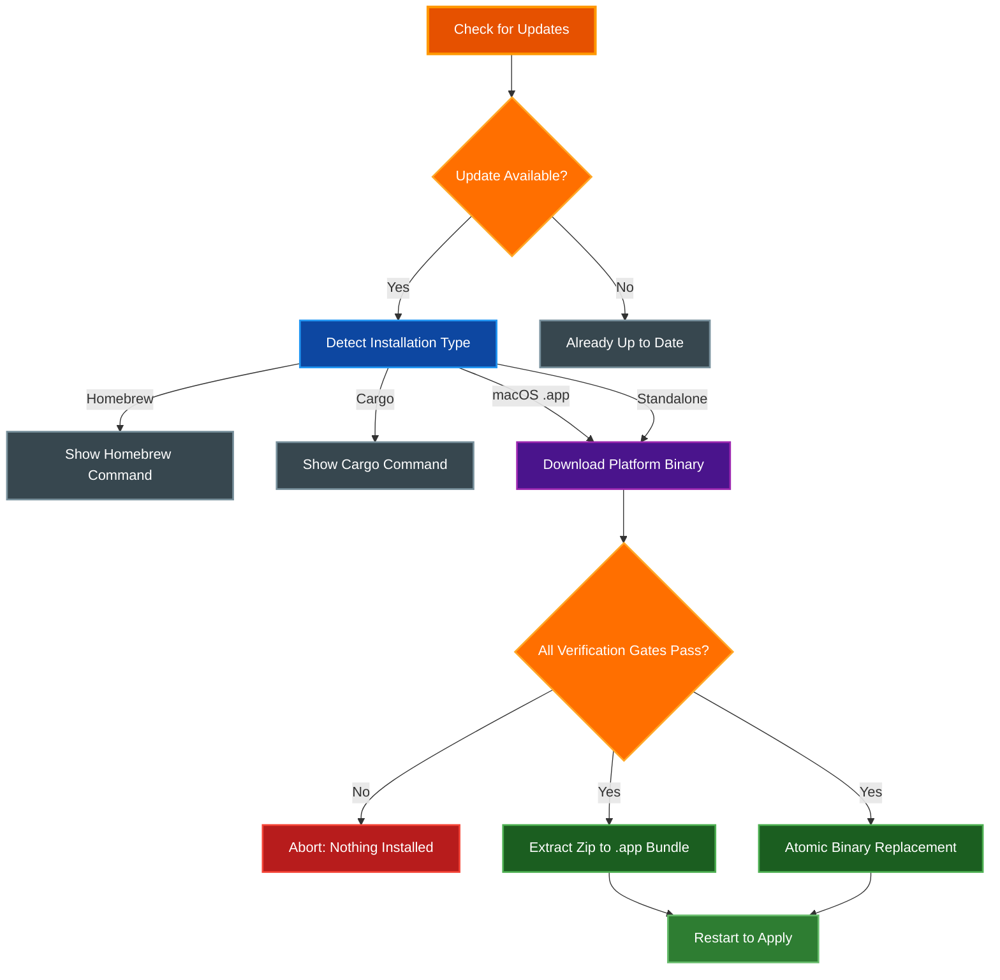
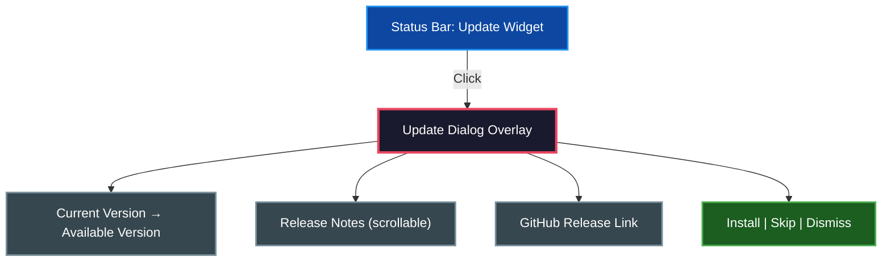

# Self-Update

par-term can check for new releases and update itself in-place, eliminating the need to manually download new versions for standalone and app bundle installations.

## Table of Contents
- [Overview](#overview)
- [Update Checking](#update-checking)
  - [Automatic Checks](#automatic-checks)
  - [Check Frequency](#check-frequency)
  - [Skip Version](#skip-version)
- [CLI Usage](#cli-usage)
- [Settings UI](#settings-ui)
- [Update Dialog](#update-dialog)
  - [Opening the Dialog](#opening-the-dialog)
  - [Dialog Layout](#dialog-layout)
  - [Actions](#actions)
  - [Installation-Type Awareness](#installation-type-awareness)
- [Installation Type Detection](#installation-type-detection)
  - [Homebrew](#homebrew)
  - [Cargo Install](#cargo-install)
  - [macOS App Bundle](#macos-app-bundle)
  - [Standalone Binary](#standalone-binary)
- [Release Verification Gates](#release-verification-gates)
  - [Why Both a Checksum and a Signature](#why-both-a-checksum-and-a-signature)
  - [The Pinned Public Key Is Currently an Empty Placeholder](#the-pinned-public-key-is-currently-an-empty-placeholder)
  - [macOS: Signing and Notarization Are Requirements, Not Warnings](#macos-signing-and-notarization-are-requirements-not-warnings)
- [Update Process](#update-process)
  - [macOS App Bundle Updates](#macos-app-bundle-updates)
  - [Linux and Windows Standalone Updates](#linux-and-windows-standalone-updates)
  - [Windows Binary Cleanup](#windows-binary-cleanup)
- [Configuration](#configuration)
- [Security Considerations](#security-considerations)
- [Troubleshooting](#troubleshooting)
- [Related Documentation](#related-documentation)

## Overview

The self-update system consists of two components that work together:

1. **Update Checker** -- Periodically queries the GitHub Releases API to determine whether a newer version is available
2. **Self-Updater** -- Downloads the appropriate platform binary and replaces the running installation in-place. On macOS it prefers the Universal build (covering both Apple Silicon and Intel) and falls back to the per-arch build on releases that predate it

The behavior depends on how par-term was installed. Managed installations (Homebrew, cargo) receive upgrade instructions instead of an in-place update, while standalone binaries and macOS app bundles are updated directly.

> **Status: in-place self-update currently refuses every release.** Before anything is downloaded, the updater checks that this build has a release-signing public key compiled in. That key ships as an empty placeholder, so the check fails and the update aborts with an explanatory error. Update checking, notifications and the release-notes dialog all work normally; only the install step is blocked. Until a key is compiled in, update by downloading a release manually or through Homebrew or cargo. See [Release Verification Gates](#release-verification-gates) for the full picture.



## Update Checking

### Automatic Checks

par-term checks for new releases automatically based on a configurable frequency. On startup, after a short delay, the update checker queries the GitHub Releases API to compare the current version against the latest published release. If a newer version is available, a desktop notification is shown.

The checker uses semantic versioning (semver) to compare versions. A version is considered newer only if its semver value is strictly greater than the current version.

### Check Frequency

Five frequency options are available:

| Frequency | Interval | Description |
|-----------|----------|-------------|
| **Never** | Disabled | No automatic checks |
| **Hourly** | 1 hour | Check every hour, aligned with the GitHub API rate limit window |
| **Daily** | 24 hours | Check once per day (default) |
| **Weekly** | 7 days | Check once per week |
| **Monthly** | 30 days | Check once per month |

The checker enforces a minimum interval of one hour between scheduled API requests to avoid rate limiting. Manual checks triggered via the Settings UI bypass this rate limit.

### Skip Version

You can suppress notifications for a specific version by clicking "Skip This Version" in the update notification or by setting `skipped_version` in the configuration. The skipped version is ignored during comparisons until a newer release supersedes it.

## CLI Usage

The `self-update` subcommand checks for updates and installs them from the command line.

**Interactive mode** (prompts for confirmation):

```bash
par-term self-update
```

**Non-interactive mode** (skips confirmation prompt):

```bash
par-term self-update --yes
par-term self-update -y
```

The CLI workflow:

1. Displays the current version and detected installation type
2. For Homebrew or cargo installations, prints the appropriate upgrade command and exits
3. Queries the GitHub Releases API for the latest version
4. Compares versions using semver; exits if already up to date
5. Shows release notes (first 10 lines) and prompts for confirmation (unless `--yes`)
6. Downloads the platform-specific binary from the release assets
7. Performs platform-specific installation (see [Update Process](#update-process))
8. Reports success and advises restarting par-term

## Settings UI

The Settings window provides graphical controls for update management under **Advanced > Updates**.

**Update frequency dropdown**: Select how often par-term checks for updates (Never, Hourly, Daily, Weekly, Monthly).

**Last checked timestamp**: Shows when the last update check occurred.

**Skipped version display**: If a version has been skipped, shows which version and provides a "Clear" button to resume notifications.

**Check Now button**: Triggers an immediate update check regardless of the configured frequency. The result is displayed inline:
- Green text for "You are running the latest version"
- Yellow text with version number when an update is available
- Red text if the check failed

**Install Update button**: When an update is available and the installation type supports in-place updates (macOS app bundle or standalone binary), an "Install Update" button appears. Clicking it downloads and installs the update with a progress indication. The button is disabled while installation is in progress.

For Homebrew and cargo installations, the Settings UI displays the appropriate upgrade command instead of an install button.

## Update Dialog

The update dialog is a modal overlay that provides detailed information about an available update and lets the user take action directly.

### Opening the Dialog

When an update is available, the status bar displays an update widget. Clicking this widget opens the update dialog overlay. The dialog appears centered over the terminal content as a floating window.

### Dialog Layout

The dialog presents the following information:

- **Version comparison**: Shows the current running version and the available version side by side
- **Release notes**: A scrollable area displaying the release notes from the GitHub release. Long release notes are fully accessible by scrolling within the dialog
- **GitHub release link**: A clickable link to the full release page on GitHub for reviewing the complete changelog, assets, and discussion



### Actions

The dialog provides three action buttons:

| Button | Behavior |
|--------|----------|
| **Install** | Downloads and installs the update in-place. Available for standalone and app bundle installations. Disabled while installation is in progress |
| **Skip** | Records the available version as skipped. The dialog closes and no further notifications appear for this version until a newer release supersedes it |
| **Dismiss** | Closes the dialog without taking action. The update widget remains in the status bar and the dialog can be reopened at any time |

### Installation-Type Awareness

The dialog adapts its content based on how par-term was installed:

| Installation Type | Dialog Behavior |
|-------------------|-----------------|
| **Standalone binary** | Shows the Install button for in-place binary replacement |
| **macOS app bundle** | Shows the Install button for in-place bundle extraction |
| **Homebrew** | Replaces the Install button with the recommended command: `brew upgrade --cask par-term` |
| **Cargo** | Replaces the Install button with the recommended command: `cargo install par-term` |

For managed installations (Homebrew and Cargo), the dialog displays the package manager command that the user can copy and run in their shell. The Skip and Dismiss buttons remain available regardless of installation type.

## Installation Type Detection

par-term automatically detects how it was installed by examining the path of the running executable. This determines whether in-place updates are possible and what update strategy to use.

| Installation Type | Path Pattern | In-Place Update |
|-------------------|-------------|-----------------|
| Homebrew | Contains `/homebrew/` or `/Cellar/` | No |
| Cargo Install | Contains `/.cargo/bin/` | No |
| macOS App Bundle | Contains `.app/Contents/MacOS/` | Yes |
| Standalone Binary | Any other path | Yes |

### Homebrew

When the executable path contains `/homebrew/` or `/Cellar/`, par-term identifies the installation as Homebrew-managed. Self-update is refused because Homebrew tracks installed packages and their versions; bypassing it would cause inconsistencies.

The CLI and Settings UI display the recommended upgrade command:

```bash
brew upgrade --cask par-term
```

### Cargo Install

When the executable path contains `/.cargo/bin/`, par-term identifies the installation as cargo-managed. Self-update is refused because cargo tracks installed crates.

The CLI and Settings UI display the recommended upgrade command:

```bash
cargo install par-term
```

### macOS App Bundle

When the executable path contains `.app/Contents/MacOS/`, par-term identifies the installation as a macOS app bundle. This type supports in-place updates by extracting a new zip archive over the existing bundle.

### Standalone Binary

Any executable path that does not match the above patterns is treated as a standalone binary. This covers Linux binaries, Windows executables, and custom installation locations. This type supports in-place updates via atomic binary replacement.

## Release Verification Gates

Every in-place update passes the same gates, in a fixed order, and every one of them is fail-closed. There is no path through the updater that installs bytes it could not verify.

1. **A release-signing key is compiled into this build.** Checked before anything is downloaded.
2. **SHA256 checksum** of the downloaded asset against the release's `<asset>.sha256` file.
3. **Detached minisign signature** of the downloaded asset against the compiled-in public key, using the release's `<asset>.minisig` file.
4. **macOS bundles only** — code signature, Team ID and Gatekeeper assessment of the *staged* bundle, before it is swapped in (see [macOS App Bundle Updates](#macos-app-bundle-updates)).

A missing asset counts as a failed check, not as "nothing to check". If a release has no `.sha256`, or no `.minisig`, the update aborts rather than proceeding unverified — otherwise an attacker who can strip an asset could turn verification off. The same applies when an asset exists but cannot be downloaded: blocking the checksum request while letting the binary request through would otherwise produce an unverified install.

All three ways of starting an install — `par-term self-update`, the Settings **Install Update** button, and the update dialog's **Install** button — go through the same code and therefore the same gates.

### Why Both a Checksum and a Signature

The binary and its `.sha256` are two assets of the same GitHub release, fetched from the same place through the same download path. Anyone able to replace one can replace the other, so the checksum defends against corruption in transit, not against a compromised release. The detached signature is what covers that second case, because it is made with a key that never exists on the release runner.

### The Pinned Public Key Is Currently an Empty Placeholder

The public key that release artifacts must verify against is a compile-time constant, `UPDATE_SIGNING_PUBLIC_KEY` in `par-term-update/src/signature.rs`, and it ships empty. An unconfigured key is treated exactly like a malformed one: it can never verify anything, so accepting an update would mean skipping the gate rather than passing it. What that means in practice:

- **Self-update refuses every release today**, on every platform and every installation type that supports in-place updates.
- **Nothing is downloaded.** The refusal happens before the release assets are fetched, so a refused update costs no bandwidth, writes no file, and leaves the installed version untouched.
- **There is no way to opt out.** The key is compiled in, so no configuration option, environment variable or CLI flag re-enables installation on a build without one, and there is no fallback to checksum-only verification.
- **The error explains itself.** It states that self-update is disabled rather than falling back to checksum-only verification, names the constant a maintainer must fill in, and links to the releases page for a manual download.

Filling the key in is a maintainer action: generate a minisign keypair off the CI runner, paste the public half into that constant, and publish a `.minisig` next to each release asset. The steps are documented in the module comment at the top of `par-term-update/src/signature.rs`.

### macOS: Signing and Notarization Are Requirements, Not Warnings

On macOS the staged bundle must additionally be signed with par-term's Apple Developer ID (Team ID `QMLVG482FY`) and pass Apple's Gatekeeper assessment. Both checks are fatal, and so is `spctl` failing to run at all — an update that cannot be assessed is not an installable update.

This is a stricter policy than a manual install faces, and the difference is deliberate rather than a contradiction. A bundle that fails Gatekeeper can still be launched by hand after clearing its quarantine attribute — that is the `xattr -cr` workaround in [Troubleshooting > macOS Gatekeeper Blocking the App](../guides/TROUBLESHOOTING.md#macos-gatekeeper-blocking-the-app) and in [Enterprise Deployment](../ENTERPRISE_DEPLOYMENT.md) — because there the user chose to download the artifact and chose to override. The updater is deciding on the user's behalf, and it will not silently overwrite a working installation with a bundle it cannot attribute to the project. A release that is not Developer ID signed to that Team ID and notarized is therefore installable by hand but not through the in-place update path.

These gates run on a staged copy beside the live bundle, and only after the checksum and signature gates have passed — so with no signing key configured they are not reached at all.

## Update Process

### macOS App Bundle Updates

The macOS release asset is a zip archive containing a complete `.app` bundle. The update process:

1. Downloads the platform-appropriate zip file (e.g., `par-term-macos-aarch64.zip` or `par-term-macos-x86_64.zip`)
2. Verifies the download's SHA256 checksum and its detached minisign signature, both against assets of the same release. Neither can be skipped, and nothing below runs until both pass — see [Release Verification Gates](#release-verification-gates)
3. Derives the `.app` root directory by navigating three levels up from the running binary (`Contents/MacOS/par-term` -> `.app/`)
4. Opens the downloaded zip archive and locates the top-level `.app` directory within it
5. Extracts all files into a **staging directory** beside the live bundle (`.par-term-update-<pid>`). The live `.app` is never written into, so any failure below leaves it exactly as it was
6. Preserves Unix file permissions from the archive entries
7. Verifies the staged bundle's code signature with `codesign --verify --deep --strict`, pinned to par-term's Apple Team ID via `-R=anchor apple generic and certificate leaf[subject.OU] = "QMLVG482FY"`. A bundle signed by anyone else, ad-hoc signed, or unsigned is rejected and the update is aborted
8. Runs `spctl --assess --type execute` on the staged bundle to check the Gatekeeper assessment (notarization). This is **fatal**, including when `spctl` itself cannot be run -- an unverifiable update is not an installable update, and nothing is installed
9. Runs `xattr -cr` on the *staged* bundle to remove macOS quarantine attributes, so the live bundle never spends a moment in a half-verified state
10. Swaps the staged bundle in with a two-rename move-aside/move-in, rolling back to the original bundle if the second rename fails
11. Reports the install path and advises restarting

### Linux and Windows Standalone Updates

Standalone binary updates use an atomic replacement strategy:

1. Downloads the platform-appropriate binary (e.g., `par-term-linux-x86_64`, `par-term-linux-aarch64`, or `par-term-windows-x86_64.exe`)
2. Verifies the download's SHA256 checksum and its detached minisign signature before any file is written — see [Release Verification Gates](#release-verification-gates)
3. Writes the downloaded binary to a temporary file alongside the current executable (with `.new` extension)
4. Sets executable permissions on Unix systems (`chmod 755`)
5. Performs the replacement:
   - **Unix (Linux/macOS)**: Uses `rename()` which is atomic on the same filesystem. The running process continues using the old inode until it exits
   - **Windows**: Renames the current executable to `.old`, then renames the new binary to the original name. The old file cannot be deleted while running, so cleanup happens on the next startup

### Windows Binary Cleanup

On Windows, the running executable cannot be deleted or overwritten directly. During self-update, the current binary is renamed to `.old` and the new binary takes its place. On the next startup, par-term automatically detects and removes the leftover `.old` file. This cleanup runs early in the startup process and logs the result. On non-Windows platforms, this cleanup is a no-op.

## Configuration

The following `config.yaml` options control update behavior:

```yaml
# How often to check for updates: never, hourly, daily, weekly, monthly
update_check_frequency: daily

# Timestamp of the last update check (managed automatically)
last_update_check: "2026-02-10T15:30:00+00:00"

# Version to skip in update notifications (e.g., "0.24.0")
skipped_version: null

# Last version we notified the user about (managed automatically)
last_notified_version: null
```

All update settings are accessible through Settings (`F12`) under **Advanced > Updates**.

## Security Considerations

- **HTTPS only**: All communication with the GitHub API and asset downloads use HTTPS with TLS
- **Host allowlist**: Only five GitHub hostnames are accepted for update-related network requests: `github.com`, `api.github.com`, `objects.githubusercontent.com`, `github-releases.githubusercontent.com`, and `release-assets.githubusercontent.com`. URLs pointing to any other host are rejected regardless of scheme or path
- **Per-hop redirect validation**: The HTTP client does not follow redirects on its own. Each `Location` is resolved, re-checked against the same HTTPS-and-allowlist policy, and only then followed, with the chain capped at 5 hops. A redirect to an off-allowlist host, or one that downgrades to `http://`, is rejected rather than followed
- **GitHub API**: Release information is fetched from the official GitHub Releases API (`api.github.com`), and binaries are downloaded from GitHub's release asset URLs
- **SHA256 checksum verification**: After downloading, the binary is verified against a `.sha256` checksum file published alongside each release asset. Verification is a hard gate: if the hashes do not match, if the checksum file fails to download, or if no checksum file exists for the release, the update is aborted. A missing or unreachable checksum file is treated as a security failure (not a warning) so a compromised or MITM-altered release cannot ship an unverified binary
- **Detached signature verification**: The download is additionally verified against a `.minisig` detached minisign signature, checked against a public key pinned at compile time. This is the gate the checksum cannot be: the `.sha256` is an asset of the same release as the binary, so it proves nothing about a *compromised* release, whereas the signing key never exists on the release runner. Only modern prehashed minisign signatures are accepted; legacy-format signatures are refused. An unconfigured key, a malformed key, a missing or malformed `.minisig`, or a signature made by a different key all abort the update. **That key currently ships empty, so self-update refuses every release** — see [Release Verification Gates](#release-verification-gates)
- **Content validation**: The downloaded archive is inspected before checksum verification to catch obviously bad responses (e.g., HTML error pages). Platform-specific magic bytes are checked: ZIP header (`PK`) for macOS, ELF header (`\x7fELF`) for Linux, and PE header (`MZ`) for Windows
- **No code execution during download**: Downloaded binaries are written to disk first and are not executed as part of the update process. The user must restart par-term to use the new version
- **Permission preservation**: On Unix systems, the new binary receives standard executable permissions (`0o755`). On macOS app bundles, Unix permissions from the zip archive entries are preserved
- **macOS code signature verification**: The updater runs `codesign --verify --deep --strict` on the *staged* bundle, before it is swapped in and before quarantine attributes are removed, with the leaf certificate pinned to par-term's Apple Team ID. If the code signature is invalid, missing, or from another developer, the update is aborted and the live bundle is untouched
- **Atomic replacement on Unix**: The `rename()` system call provides atomic replacement, ensuring the binary is never in a partially-written state
- **Safe Windows replacement**: On Windows, the rename-based strategy ensures the original binary is preserved as `.old` until the new version starts successfully
- **No privilege escalation**: The update runs with the same permissions as the running process. If par-term does not have write access to its own binary, the update fails with a clear error message
- **Rate limiting**: The update checker enforces a minimum one-hour interval between API requests to avoid triggering GitHub rate limits
- **User confirmation**: In interactive mode (both CLI and Settings UI), the user must explicitly confirm before the update proceeds

## Troubleshooting

**"par-term is installed via Homebrew" error**:
par-term detected a Homebrew installation. Use `brew upgrade --cask par-term` instead.

**"par-term is installed via cargo" error**:
par-term detected a cargo installation. Use `cargo install par-term` instead.

**"Could not find par-term-<platform> in the latest release" error**:
The latest GitHub release does not contain a binary for your OS and architecture. Check the [releases page](https://github.com/paulrobello/par-term/releases) for supported platforms.

**"Failed to fetch release info" error**:
Network connectivity issue or GitHub API rate limit. Try again later or check your internet connection.

**"Failed to replace binary: Permission denied" error**:
The running process does not have write access to its installation directory. On Linux, you may need to run the update with appropriate permissions if the binary is in a system directory.

**"This build of par-term has no release-signing public key compiled in" error**:
Expected on every current build, and the error every install attempt hits first. The updater will not install an update it cannot prove came from the par-term maintainer, and it does not fall back to checksum-only verification. Download the release manually from the [GitHub releases page](https://github.com/paulrobello/par-term/releases), or use `brew upgrade --cask par-term` / `cargo install par-term` if par-term is managed that way. Nothing was downloaded and your installation is untouched. See [Release Verification Gates](#release-verification-gates).

**"No .sha256 checksum file found in release" / "refusing to install an unverified binary" error**:
The release does not include a `.sha256` checksum asset, or the checksum file could not be downloaded and the update was aborted for safety. This is intentional: a missing or unreachable checksum is treated as a security failure, not a warning. Download the binary manually from the [GitHub releases page](https://github.com/paulrobello/par-term/releases) and verify it yourself before installing. (While the signing key above is unset, the key check aborts first and this error is not reached.)

**"No .minisig signature file found in release" / "refusing to install an unsigned binary" error**:
The release does not include a `.minisig` detached signature for your platform's asset. As with the checksum, a missing signature is a hard failure rather than a skipped step, because the two are indistinguishable from an attacker's point of view. Download the release manually instead. (Also not reached while the signing key above is unset.)

**"Signature verification FAILED for the downloaded update" error**:
A `.minisig` was present but did not verify: the download does not carry a valid signature from the key this build trusts. Do not install it manually either — treat it as a tampered or mis-signed release and report it.

**Updated app is blocked by Gatekeeper / "app is damaged"**:
macOS applies a quarantine attribute to files downloaded from the internet. When par-term updates itself, the updater strips this attribute by running `xattr -cr` on the new `.app` bundle. If you encounter this error after a manual installation or an interrupted update, remove the quarantine attribute manually:

```bash
xattr -cr /Applications/par-term.app
```

Then launch par-term normally. If the problem persists, verify that the binary is not corrupted by comparing its checksum against the release asset on the [GitHub releases page](https://github.com/paulrobello/par-term/releases).

**Update installed but old version still running**:
A restart is required after every update. Close and reopen par-term to use the new version.

## Related Documentation

- [INTEGRATIONS.md](INTEGRATIONS.md) - Shell integration and shader installation
- [ARCHITECTURE.md](../architecture/ARCHITECTURE.md) - System architecture overview
- [../CHANGELOG.md](../../CHANGELOG.md) - Version history and release notes
- [../README.md](../../README.md) - Project overview and getting started
