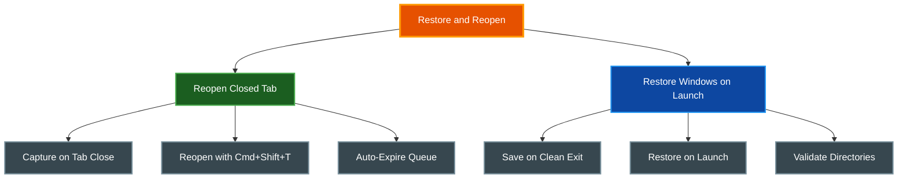

# Restoring Windows and Reopening Tabs

par-term can reopen accidentally closed tabs and restore every window, tab, and pane layout when it launches.

## Table of Contents
- [Overview](#overview)
- [Reopen Closed Tabs](#reopen-closed-tabs)
  - [Usage](#usage)
  - [Keeping the Shell Running](#keeping-the-shell-running)
  - [Configuration](#configuration)
- [Restore Windows on Launch](#restore-windows-on-launch)
  - [What Gets Saved](#what-gets-saved)
  - [Restore Behavior](#restore-behavior)
  - [Configuration](#configuration-1)
- [Restore Windows on Launch vs Window Arrangements](#restore-windows-on-launch-vs-window-arrangements)
- [Related Documentation](#related-documentation)

## Overview



## Reopen Closed Tabs

Recover accidentally closed tabs by reopening them with their original metadata.

### Usage

| Action | macOS | Linux/Windows |
|--------|-------|---------------|
| Reopen closed tab | `Cmd + Shift + T` (alias `Cmd + Z`) | `Ctrl + Shift + Z` |

When a tab closes, par-term captures its metadata (working directory, title, whether you renamed it, custom icon, position, pane layout, custom color) and adds it to an undo queue. A toast notification appears with an **Undo** button, the expiry timeout in seconds, and the live reopen chord (left out when `reopen_closed_tab` is unbound).

**Restored tab state:**
- Original tab position in the tab bar
- Tab title and custom color
- A name you gave the tab (it stays fixed; a later program title does not replace it) and its custom icon
- Working directory
- Split pane layout (if the tab had split panes)

### Keeping the Shell Running

When `session_undo_preserve_shell` is enabled, closing a tab hides the shell process instead of killing it. Undoing restores the live tab including:

- Scrollback buffer content
- Running processes
- Complete pane layout
- User-set tab name and custom icon

When disabled (default), undo starts a new shell in the tab's original working directory.

Expired undo entries automatically kill hidden shell processes to prevent resource leaks.

### Configuration

```yaml
# Timeout in seconds before undo entries expire (0 = disabled)
session_undo_timeout_secs: 5

# Maximum number of undo entries in the queue
session_undo_max_entries: 10

# Keep the shell process running on tab close so reopening restores it live
session_undo_preserve_shell: false
```

**Settings UI:** Settings > General > Closing & Quitting

## Restore Windows on Launch

Automatically save your windows, tabs, and pane layouts on clean exit and restore them when par-term launches.

### Recovery After a Crash

par-term also keeps a crash snapshot. While running, the event loop republishes a
serialized copy of your windows every five seconds, and a panic handler writes it to
`crash_session.yaml` in the config directory before the process dies. On the next
launch that file is preferred over `last_session.yaml`, consumed, and a toast reports
that the windows were recovered.

**This requires `restore_session: true`, which is not the default.** Both halves are
gated on it: with Restore windows on launch turned off, nothing is ever published, so no crash file is
written, and nothing would consume one if it were.

Three further limits are worth knowing. The snapshot is at most five seconds old, so
one very recent tab or directory change can be missing. It only covers panics — a
segmentation fault, a stack overflow, an out-of-memory kill or `kill -9` run no
handler at all, so nothing is written. And scrollback and running processes are never
preserved by either path.

The panic report itself goes to the debug log. Because a crash is normally followed by
an immediate restart, look for it in the rolled-aside `par_term_debug.log.1` rather
than the live log — see [Logging](../LOGGING.md#log-file-location).

### What Gets Saved

- Open windows with their positions and sizes
- All tabs in each window with their working directories
- User-set tab names (`user_title`) -- when a tab has been manually renamed, the custom name is preserved and restored
- Custom tab colors -- any per-tab color set by the user is saved as an RGB value and restored
- Custom tab icons -- icons assigned via the tab context menu are persisted and restored
- Split pane trees with split ratios
- Active tab index per window
- Active tmux control-mode session name per window (if connected)
- Active par-mux session name per window (if attached)

Hidden tabs (such as the tmux gateway tab when `tmux_hide_gateway_tab` is enabled) are excluded from the saved tab list — they are transient connections, not user tabs.

### Reattaching a tmux Session

When a window was connected to a tmux session in control mode at the time of save, the session name is persisted alongside the window. On restore:

1. A single empty gateway shell tab is created for the window.
2. `initiate_tmux_gateway(session_name)` is called to reconnect to the tmux session using create-or-attach semantics.
3. The real tmux window tabs are populated by the tmux session via normal layout-change notifications — the saved tab list is not used to spawn additional shells.

This avoids duplicate tabs (ghost shells + real tmux windows) that would otherwise appear if saved tab CWDs were restored alongside a live tmux reconnect.

Requires `tmux_enabled: true`. Failures to reconnect are logged as warnings; the window opens normally with the gateway shell tab in that case.

### Reattaching a par-mux Session

A window attached to a par-mux session at save time persists `mux_session_name` and reattaches on restore:

1. A single local placeholder tab is created so a failed attach never leaves the window empty.
2. `begin_mux_session_attach(name)` reconnects (create-or-attach) on a worker thread.
3. The daemon's windows arrive as tabs via `%window-add`; the first one closes the placeholder, so the restored window holds only daemon tabs.

If the attach fails, the placeholder stays and the window works as a normal local-shell window. An emptied session is not persisted: when every daemon window has closed (exiting each shell), the save drops `mux_session_name` so relaunch does not reattach to a session the user deliberately ended. A window quit while daemon panes are live still reattaches.

### Restore Behavior

- Window state saves automatically when par-term exits cleanly
- On next launch, the saved windows restore automatically
- Working directories are validated on restore; missing directories fall back to `$HOME`
- Corrupt or missing saved-windows files result in a default window being created
- The saved-windows file clears after successful restore to prevent restoring stale state

### Configuration

```yaml
# Enable session restore on startup (default: false)
restore_session: false
```

**Settings UI:** Settings > General > Startup & Restore > "Restore windows on launch"

## Restore Windows on Launch vs Window Arrangements

Both features restore window layouts, but they serve different purposes:

| Feature | Restore Windows on Launch | Window Arrangements |
|---------|----------------|---------------------|
| **Purpose** | Resume where you left off | Named, reusable layouts |
| **Trigger** | Automatic on exit/launch | Manual save and restore |
| **Persistence** | One-time (cleared after restore) | Permanent until deleted |
| **Scope** | Every open window | Named layout snapshots |
| **Priority** | Falls back when no arrangement | Takes precedence when both enabled |

When both `restore_session` and `auto_restore_arrangement` are enabled, auto-restore arrangement takes precedence.

## Related Documentation

- [Window Management](WINDOW_MANAGEMENT.md) - Window types and arrangements
- [Arrangements](ARRANGEMENTS.md) - Named window layout management
- [Tabs](TABS.md) - Tab management
- [Keyboard Shortcuts](../guides/KEYBOARD_SHORTCUTS.md) - All keyboard shortcuts
